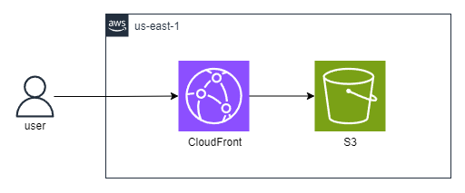

# tst-vivoempresas

Aplicação web para apresentação de planos e tecnologias disponíveis para os usuários.

## IDE Setup
[VSCode](https://code.visualstudio.com/) + [Volar](https://marketplace.visualstudio.com/items?itemName=Vue.volar)

#### Tecnologias principais
- Vue 3
- TypeScript  
- SCSS
- Vue-router

#### Ferramentas
- Vite
- husky (hooks aos comandos git)
- Github Actions
- AWS

#### Plugins auxiliares para o Vite
- unplugin-vue-components (auto import de componentes)
- vite-plugin-webfont-dl (download automático de fontes)
- vite-svg-loader (import de `.svg` como componentes)

### Testes
- Vitest
- Testing-library/vue
- faker-js

## Arquitetura na AWS




## Instalação das dependências

```sh
npm install
```

### Modo Desenvolvimento

```sh
npm run dev
```

### Checa tipos e compila para Produção

```sh
npm run build
```

### Run Unit Tests with [Vitest](https://vitest.dev/)

```sh
npm run test:unit
```
